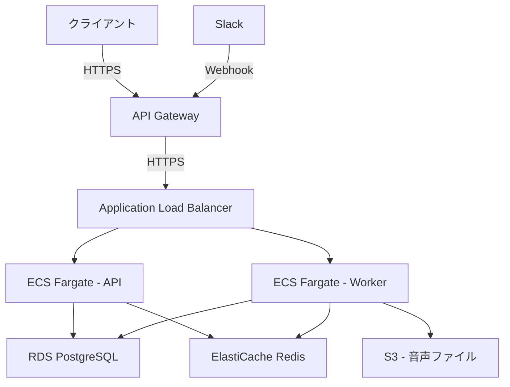
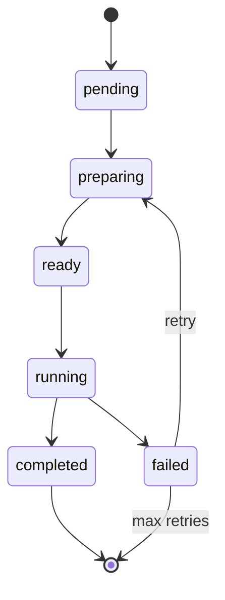

# 議事録AIエージェント

## 概要
このプロジェクトは、会議中の議事録をリアルタイムで分析し、議論の方向性の示唆や確認漏れを検出し、Slackを通じてメンバーに通知するAIエージェントです。また、会議終了後には、対象者に応じた議事録の要約を自動生成し、Slackに通知します。

## 技術構成

### 1. 音声認識・文字起こし
- **Whisper API**: 会議の音声をリアルタイムで文字起こし
- **WebSocket**: リアルタイム音声ストリーミング
- **Google Meet API**: Google Meetの音声ストリーム取得
- **Gemini API**: 音声文字起こしと議事録分析

### 2. 議事録分析・要約
- **GPT-4**: 議事録の分析、要約、示唆の生成
- **LangChain**: プロンプトの管理、複数LLMの連携
- **Vector DB**: 過去の議事録や関連ドキュメントの保存・検索

### 3. 通知システム
- **Slack API**: リアルタイム通知、要約の送信
- **Webhook**: イベント駆動型の通知処理

### 4. データ管理
- **PostgreSQL**: 議事録、メタデータの保存
- **Redis**: キャッシュ、セッション管理

### 5. フロントエンド
- **React**: ダッシュボードUI
- **TypeScript**: 型安全な開発
- **Tailwind CSS**: スタイリング

## 主要機能

1. **リアルタイム分析**
   - 議論の方向性の示唆
   - 確認漏れの検出
   - 重要なポイントのハイライト

2. **議事録要約**
   - メンバー向け: 詳細な議論内容、アクションアイテム
   - マネージャー向け: 意思決定ポイント、リソース要件
   - 社長向け: 戦略的な観点からの要約
   - ブログ向け: 公開可能な形式での要約

3. **通知管理**
   - リアルタイムアラート
   - 要約の自動配信
   - カスタマイズ可能な通知設定

## セットアップ

```bash
# 依存関係のインストール
bun install

# 環境変数の設定
cp .env.example .env

# 開発サーバーの起動
bun dev
```

## 環境変数

```env
OPENAI_API_KEY=your_api_key
SLACK_BOT_TOKEN=your_bot_token
SLACK_SIGNING_SECRET=your_signing_secret
DATABASE_URL=your_database_url
REDIS_URL=your_redis_url
GOOGLE_CLIENT_ID=your_client_id
GOOGLE_CLIENT_SECRET=your_client_secret
GOOGLE_REDIRECT_URI=your_redirect_uri
GEMINI_API_KEY=your_gemini_api_key
```

## ライセンス
MIT 

## インフラ設計図



## システムアーキテクチャ

### クリーンアーキテクチャ構成
```
src/
├── domain/           # ドメインモデル
│   ├── entities/     # エンティティ
│   ├── repositories/ # リポジトリインターフェース
│   └── usecases/     # ユースケース
├── infrastructure/   # インフラ層
│   ├── database/     # DB接続
│   ├── repositories/ # リポジトリ実装
│   └── services/     # 外部サービス連携
├── interfaces/       # インターフェース層
│   ├── controllers/  # コントローラー
│   ├── presenters/   # プレゼンター
│   └── routes/       # ルーティング
└── main.ts           # エントリーポイント
```

## APIエンドポイント

### タスク管理
```
GET    /api/v1/tasks           # タスク一覧取得
POST   /api/v1/tasks           # タスク作成
GET    /api/v1/tasks/:id       # タスク詳細取得
PUT    /api/v1/tasks/:id       # タスク更新
DELETE /api/v1/tasks/:id       # タスク削除
```

### 進捗管理
```
GET    /api/v1/progress        # 進捗一覧取得
GET    /api/v1/progress/:id    # 進捗詳細取得
POST   /api/v1/progress        # 進捗記録作成
PUT    /api/v1/progress/:id    # 進捗更新
```

### 議事録管理
```
GET    /api/v1/meetings           # 議事録一覧取得
POST   /api/v1/meetings           # 議事録作成
GET    /api/v1/meetings/:id       # 議事録詳細取得
PUT    /api/v1/meetings/:id       # 議事録更新
DELETE /api/v1/meetings/:id       # 議事録削除
POST   /api/v1/meetings/:id/summary  # 議事録要約生成
```

### Google Meet Webhook
```
POST   /api/v1/webhooks/google-meet     # Google Meetからの音声ストリーム受信
POST   /api/v1/webhooks/gemini          # Gemini APIからのレスポンス受信
```

## データベース設計

### タスクテーブル
```sql
CREATE TABLE tasks (
    id UUID PRIMARY KEY,
    title VARCHAR(255) NOT NULL,
    description TEXT,
    status VARCHAR(50) NOT NULL CHECK (status IN ('pending', 'preparing', 'ready', 'running', 'completed', 'failed')),
    priority INTEGER,
    due_date TIMESTAMP,
    retry_count INTEGER DEFAULT 0,
    max_retries INTEGER DEFAULT 3,
    error_message TEXT,
    created_at TIMESTAMP NOT NULL DEFAULT CURRENT_TIMESTAMP,
    updated_at TIMESTAMP NOT NULL DEFAULT CURRENT_TIMESTAMP
);

-- タスク状態履歴テーブル
CREATE TABLE task_status_history (
    id UUID PRIMARY KEY,
    task_id UUID REFERENCES tasks(id),
    status VARCHAR(50) NOT NULL,
    created_at TIMESTAMP NOT NULL DEFAULT CURRENT_TIMESTAMP
);
```

### Google Meetセッションテーブル
```sql
CREATE TABLE google_meet_sessions (
    id UUID PRIMARY KEY,
    meeting_id VARCHAR(255) NOT NULL,
    start_time TIMESTAMP NOT NULL,
    end_time TIMESTAMP,
    status VARCHAR(50) NOT NULL,
    transcript TEXT,
    created_at TIMESTAMP NOT NULL DEFAULT CURRENT_TIMESTAMP,
    updated_at TIMESTAMP NOT NULL DEFAULT CURRENT_TIMESTAMP
);
```

## 非同期タスク処理

### タスク状態遷移図


### タスク処理フロー
1. タスク作成時に`pending`状態で登録
2. ワーカーがタスクを取得し`preparing`状態に変更
3. 必要なリソース準備後`ready`状態に変更
4. 実行可能になったら`running`状態に変更
5. 処理完了で`completed`状態に変更
6. エラー発生時は`failed`状態に変更し、リトライ可能な場合は`preparing`状態に戻す

## 実装例（Hono）

```typescript
// タスクコントローラー
import { Hono } from 'hono'
import { TaskRepository } from '../infrastructure/repositories/task'
import { TaskUseCase } from '../domain/usecases/task'

const app = new Hono()

const taskRepository = new TaskRepository()
const taskUseCase = new TaskUseCase(taskRepository)

// Google Meet Webhook
app.post('/webhooks/google-meet', async (c) => {
  const data = await c.req.json()
  const task = await taskUseCase.createGoogleMeetTask(data)
  return c.json(task, 201)
})

// Gemini Webhook
app.post('/webhooks/gemini', async (c) => {
  const data = await c.req.json()
  await taskUseCase.processGeminiResponse(data)
  return c.json({ status: 'ok' })
})

// タスク状態更新
app.put('/tasks/:id/status', async (c) => {
  const id = c.req.param('id')
  const { status } = await c.req.json()
  const task = await taskUseCase.updateTaskStatus(id, status)
  return c.json(task)
})

// ... 他のエンドポイント
``` 