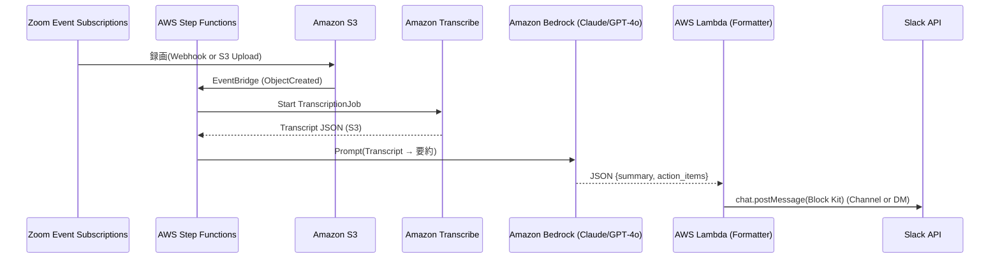

```mermaid
sequenceDiagram
    participant Zoom as Zoom Event Subscriptions
    participant StepFn as AWS Step Functions
    participant S3 as Amazon S3
    participant Tr as Amazon Transcribe
    participant Bedrock as Amazon Bedrock (Claude/GPT‑4o)
    participant Lambda as AWS Lambda (Formatter)
    participant Slack as Slack API

    Zoom->>S3: 録画(Webhook or S3 Upload)
    S3->>StepFn: EventBridge (ObjectCreated)
    StepFn->>Tr: Start TranscriptionJob
    Tr-->>StepFn: Transcript JSON (S3)
    StepFn->>Bedrock: Prompt(Transcript → 要約)
    Bedrock-->>Lambda: JSON {summary, action_items}
    Lambda->>Slack: chat.postMessage(Block Kit) (Channel or DM)
```